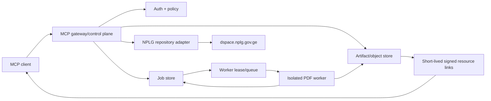

# Handoff: NPLG DSpace MCP — архитектурное усиление, инструменты и оценка Rust-переписывания

**Дата снимка:** 2026-08-14  
**Репозиторий:** `DavidOsipov/nplg-dspace-mcp`  
**Проверенный `main`:** `2ba5dc18385747aa5d12a3b560eaab2ab97b7a40`  
**Проверенное дерево:** `b17c840ddd3c0dc0ec98fb150e18c22cf6c3b9e8`  
**Режим подготовки handoff:** строго read-only; репозиторий не изменялся  
**Аудитория:** следующий ИИ-агент или инженер, которому Давид явно поручит проектирование либо реализацию

> Перед любой работой заново прочитайте `main` и зафиксируйте актуальный SHA. Этот документ описывает именно указанный снимок. Не считайте старые verification reports автоматически актуальными, если SHA уже изменился.

---

## 1. Краткий вывод

### Рекомендуемое решение

Не начинать с полного переписывания всего проекта на Rust.

Оптимальная последовательность:

1. **Сохранить текущую Python-реализацию как проверяемый baseline.**
2. **Немедленно изолировать PDFium в отдельном процессе или worker-контейнере.**
3. **Убрать самописный MCP wire layer**, заменив его официальным SDK:
   - краткосрочно — Python MCP SDK v2;
   - либо, если стандартные MCP Tasks и долгие операции являются центральным требованием, — Rust `rmcp` v3 как control plane.
4. **Вынести задания и артефакты в устойчивые интерфейсы**: job store + object store.
5. После этого провести **ограниченный Rust spike**, а не rewrite-by-faith.
6. Портировать на Rust сначала MCP/control plane, затем NPLG/OAI-адаптер; PDF-движок портировать последним и только после доказанной parity.

### Наиболее сильная долгосрочная архитектура

```text
Rust MCP control plane (`rmcp` v3)
        │
        ├── auth / scopes / per-client limits
        ├── MCP 2026-07-28 + legacy compatibility
        ├── Tasks / cancellation / progress
        ├── NPLG search + metadata + bitstream discovery
        ├── durable job state
        └── MCP resources / signed object links
                    │
                    ▼
          isolated PDF worker
          (сначала Python + pypdfium2)
                    │
                    ▼
        S3-compatible object storage
        + SQLite/PostgreSQL job/artifact index
```

Это даёт Rust там, где его преимущества максимальны: протокол, типизация, конкурентность, task state machine, cancellation, HTTP middleware и эксплуатационная компактность. Одновременно сохраняется уже написанная и протестированная PDF-логика, пока Rust-порт не докажет функциональную эквивалентность.

### Уверенность

- Немедленно изолировать PDFium из thread pool: **~97%**.
- Сохранить Python baseline до parity: **~95%**.
- Перейти с самописного MCP protocol на официальный SDK: **~90%**.
- Rust control plane + Python PDF worker как долгосрочная цель: **~82%**.
- Полный Rust rewrite уже сейчас даст лучший общий результат: **~45–55%**.
- Полный Rust rewrite автоматически сделает обработку PDF безопасной: **низкая уверенность; тезис в целом неверен**, поскольку PDFium останется нативной C/C++ границей.

---

## 2. Важное терминологическое уточнение

`rmcp v3.1.2` — это **major version официального Rust SDK**, а не «MCP protocol v3».

Актуальный стабильный MCP остаётся date-versioned:

```text
2026-07-28
```

Rust SDK v3 поддерживает эту ревизию и обратную совместимость с `2025-11-25` и более ранними поддерживаемыми версиями. Не проектируйте API вокруг вымышленного «MCP v3».

На момент снимка:

- latest GitHub release Rust SDK: `rmcp-v3.1.2`;
- roadmap Rust SDK заявляет 100% conformance по date-versioned server/client suites для `2025-11-25` и `2026-07-28`;
- центральная страница MCP SDK tiers всё ещё могла показывать Rust как Tier 2, тогда как собственный roadmap Rust SDK заявляет выполнение Tier 1 criteria. Это несогласованность метаданных, поэтому опирайтесь на конкретные conformance runs, release notes и нужные вам features, а не только на tier label.

---

## 3. Что уже хорошо сделано в текущем репозитории

Нельзя переписывать проект, исходя из предположения, что текущий код «простой» или «одноразовый». В нём накоплены существенные инварианты.

### 3.1. Безопасный upstream boundary

Уже реализованы:

- точный allowlist origin `https://dspace.nplg.gov.ge`;
- канонические handle и URL;
- ограниченный набор допустимых путей;
- запрет credentials, нестандартного порта, fragments и опасных encodings;
- проверка redirect на каждом шаге;
- отказ от proxy inheritance;
- отказ от cookies;
- `Accept-Encoding: identity`;
- DNS-проверка на non-global addresses;
- streaming limits;
- ограничения MIME и `%PDF-` signature;
- запрет произвольных URL: скачивается только bitstream, ранее найденный на конкретной item page.

Это ценный security contract, который должен быть перенесён тестами, а не переписан «по памяти».

### 3.2. Сильное локальное хранилище

`ContentAddressedStore` уже содержит нетривиальные свойства:

- content addressing по SHA-256;
- exclusive/no-follow staging;
- staged byte reservations;
- quota accounting;
- повторное хеширование перед commit;
- проверки device/inode/size/mtime/ctime;
- atomic replace;
- directory `fsync`, где он доступен;
- render transactions и rollback;
- очистка incomplete renders;
- symlink/path traversal checks;
- manifest-to-asset integrity verification;
- striped render locks.

Этот код нельзя выбрасывать без эквивалентных property tests и failure-injection tests.

### 3.3. Точная PDF-семантика

Текущий PDF pipeline различает:

- `single_raster_jpeg`;
- `single_raster_other`;
- `raster_with_overlay`;
- `mixed`;
- `vector`.

Также реализованы:

- byte-preserving extraction terminal DCT/JPEG stream, когда это доказуемо;
- визуальная проверка эквивалентности embedded JPEG и rendered page;
- native embedded-scan pixel grid;
- явный `fallback_400_dpi`;
- отсутствие post-render resize;
- crop-only tiles;
- координаты и SHA-256;
- manifest validation;
- маркировка `reencoded`, `lossy_conversion`, `renderer_resampling`, `pixel_dimensions_preserved`.

Эти признаки должны стать language-neutral contract fixtures.

### 3.4. Хорошие API boundaries

Сильные элементы:

- строгие Pydantic input models с `extra="forbid"` и strict mode;
- доменные модели документов, bitstreams, manifests и tiles;
- upstream-read-only модель;
- cache-writing tools уже не помечены как `readOnlyHint=true`;
- signed asset capabilities;
- отдельные слои repository/downloader/storage/pdf/tools;
- test categories: unit, integration, security, static, conformance, fixtures.

### 3.5. Supply-chain и container hardening

Уже присутствуют:

- exact pins;
- hash-locked runtime requirements;
- binary-only installation;
- pinned base image digest;
- non-root UID/GID;
- read-only application filesystem;
- dropped capabilities;
- `no-new-privileges`;
- PID/CPU/memory constraints;
- private application port за Caddy;
- отключённые request access logs для предотвращения утечки signed URLs.

Не ухудшать эти свойства при смене языка.

---

## 4. Приоритетные находки и улучшения

## P0 — выполнить до функционального расширения или Rust rewrite

### P0.1. Убрать параллельные PDFium-вызовы из Python threads

#### Текущее состояние

`ToolService._run_pdf_job()` запускает PDF-работу через:

```python
asyncio.to_thread(...)
```

Параллельность регулируется semaphore:

```text
MAX_CONCURRENT_PDF_JOBS default = 2
compiled maximum = 4
```

Это означает, что два или более thread могут одновременно входить в PDFium внутри одного процесса.

#### Почему это критично

Документация pypdfium2 прямо указывает:

- PDFium inherently not thread-safe;
- threading несовместим;
- для параллельной обработки следует использовать отдельные процессы.

Даже Rust wrapper не устраняет этот фундаментальный факт: `pdfium-render` по умолчанию сериализует доступ глобальным mutex, а для настоящего параллелизма рекомендуются процессы.

#### Немедленная временная мера

До архитектурного исправления:

```text
MAX_CONCURRENT_PDF_JOBS=1
```

И добавить startup assertion/warning, запрещающий значение выше 1 для in-process/thread backend.

Это mitigation, не финальное решение.

#### Финальное решение

PDF worker должен быть отдельно убиваемым:

```text
web/MCP process
    └── spawn worker process
            ├── no network
            ├── read-only source PDF
            ├── private temp output directory
            ├── memory/CPU/file-size/PID limits
            ├── hard wall-clock timeout
            └── parent validates every output before publish
```

Варианты реализации:

- single-use subprocess per job — наиболее простая и сильная изоляция;
- fixed process pool с `max_tasks_per_child=1` или небольшим значением;
- отдельный container worker;
- Kubernetes/Cloud Run job для тяжёлых операций.

Не использовать `asyncio.to_thread()`, `spawn_blocking()` или Rust threads как security boundary для untrusted PDF.

### P0.2. Сделать CI и protected `main` обязательными

На проверенном снимке:

- `main` не protected;
- нет required status checks;
- в текущем tree не найдено `.github/workflows`;
- commit statuses отсутствовали.

Это особенно опасно перед rewrite: большая тестовая база существует, но не является merge gate.

Минимальный CI:

```text
Python 3.13
Python 3.14 compatibility
pytest
compileall
coverage threshold
mypy or pyright strict
ruff
Bandit
Semgrep
pip-audit
Docker build
container smoke test
Trivy/Grype image scan
Syft/CycloneDX SBOM
official MCP conformance / Inspector
live NPLG canary as scheduled, non-blocking unless contract drift is confirmed
```

Repository settings:

- PR-only changes в `main`;
- required review;
- required green checks;
- signed commits/tags;
- no force-push;
- no branch deletion;
- CODEOWNERS для security-sensitive surfaces;
- `SECURITY.md`;
- dependency update bot;
- secret scanning и push protection.

### P0.3. Заморозить cross-language behavioral contract

До любого порта экспортировать baseline:

- tool catalog и input/output schemas;
- JSON-RPC/MCP fixtures для обеих protocol revisions;
- error-code mapping;
- DSpace HTML/OAI fixtures;
- download validation fixtures;
- PDF synthetic corpus;
- page inspections;
- render manifests;
- tile manifests;
- direct-extract JPEG hashes;
- pixel-equivalence fixtures;
- storage failure fixtures;
- signed-token vectors.

Сделать tests language-neutral, например:

```text
contracts/
  tool-catalog.json
  schemas/
  mcp/
  nplg/
  pdf/
  manifests/
  tokens/
  expected/
```

Python baseline и Rust candidate должны прогоняться против одного contract pack.

---

## P1 — архитектурные изменения с высоким ROI

### P1.1. Заменить самописный MCP protocol на официальный SDK

Сейчас `src/nplg_mcp/protocol.py` вручную реализует:

- strict JSON;
- protocol negotiation;
- standard headers;
- metadata envelope;
- legacy initialize;
- discovery;
- tools/resources;
- cache hints;
- errors;
- resource links.

Код тщательно написан, но является постоянным compatibility burden. Любое изменение MCP требует ручного отслеживания и повторной реализации.

#### Python path

Официальный Python MCP SDK v2.0.0:

- поддерживает `2026-07-28` и предыдущие protocol eras;
- предоставляет `MCPServer`;
- умеет Streamable HTTP;
- имеет extension APIs;
- OpenTelemetry;
- OAuth facilities;
- MCP Apps support.

Известное ограничение v2.0.0: standard Tasks extension ещё не входила в stable release.

#### Rust path

Официальный Rust `rmcp` v3:

- поддерживает `2026-07-28` и legacy versions;
- stateless Streamable HTTP;
- typed tools + JSON Schema;
- resource/prompt APIs;
- standard header handling;
- cancellation/progress;
- documented task flow;
- Tower service integration;
- OAuth feature.

#### Миграционная стратегия

Не удалять custom protocol первым коммитом.

1. Создать SDK adapter рядом.
2. Запустить differential tests:
   - один input;
   - старый и новый transport;
   - сравнить catalog, schemas, structured output и errors.
3. Перевести clients/tests на официальный SDK.
4. Удалять custom protocol только после parity и conformance.

### P1.2. Исправить несогласованность MCP resources

Код возвращает URI вида:

```text
nplg://render/<id>/page/<n>
nplg://render/<id>/page/<n>/tile/<tile_id>
```

Но `read_resource()` на снимке реализует только:

```text
nplg://about
nplg://artifact/<doc_id>
nplg://render/<render_id>/manifest
```

Следовательно, часть emitted `resource_uri` выглядит как читаемый MCP resource, но не читается через `resources/read`.

Нужно выбрать одно:

1. Реализовать resource templates и `resources/read` для page/tile;
2. либо перестать публиковать внутренние URI, которые не имеют resolver;
3. либо публиковать только HTTP `resource_link` к object storage.

Рекомендация: добавить resource templates и отдельные compact resources, а большие binary objects отдавать через signed object URL.

### P1.3. Не дублировать большие результаты в `content` и `structuredContent`

Текущий protocol сериализует весь structured result:

- в текстовый JSON content block;
- и повторно в `structuredContent`.

Для metadata, render manifest и 100 tile links это:

- удваивает response size;
- увеличивает token consumption;
- повышает вероятность body/client limits;
- делает модель менее эффективной.

Рекомендуемый pattern:

```text
content:
  короткое human-readable summary

structuredContent:
  compact typed result

resource_link:
  полный manifest / binary artifact
```

Для tiles:

- возвращать summary + manifest resource;
- либо пагинацию;
- либо tool `get_render_tiles_page`;
- не вставлять десятки signed URLs дважды.

Добавить explicit server-side response-size ceiling.

### P1.4. Версионировать pipeline semantics, а не только зависимости

Render ID сейчас зависит от:

- source SHA;
- page selection;
- mode;
- fallback DPI;
- PDFium/pypdfium2/Pillow versions.

Но если поменять:

- classification heuristic;
- visual equivalence threshold;
- dominant coverage threshold;
- rotation/crop logic;
- JPEG parameters;
- manifest semantics,

не меняя dependency versions, старый cache ID может остаться прежним.

Добавить:

```text
manifest_schema_version
render_pipeline_version
classification_algorithm_version
tile_pipeline_version
```

И включить их в:

- render ID;
- tile geometry/cache key;
- manifest;
- provenance output.

Старые manifests должны либо мигрировать, либо читаться через versioned decoder, либо считаться stale.

### P1.5. Ввести durable task/job model

Текущий flow требует последовательного локального состояния:

```text
download
→ inspect
→ render
→ tiles
```

Это плохо совместимо с:

- serverless;
- рестартами;
- горизонтальным scaling;
- long-running operations;
- cancellation;
- retries;
- Alpic 30-second tool limit.

Нужна state machine:

```text
QUEUED
→ CLAIMED
→ RUNNING
→ SUCCEEDED | FAILED | CANCELLED | EXPIRED
```

Обязательные поля:

```text
job_id
job_type
principal_id
idempotency_key
source_handle
source_bitstream_id
source_sha256
parameters
pipeline_version
status
attempt
lease_owner
lease_expires_at
created_at
started_at
finished_at
error_code
result_manifest_uri
```

Идемпотентность:

```text
SHA256(
  job_type
  + source_sha256
  + canonical_parameters
  + pipeline_version
)
```

Retry только для явно retryable и idempotent stages.

### P1.6. Абстрагировать storage

Текущий filesystem store силён для single-node, но:

- quota и locks process-local;
- startup scan линейный;
- нет automatic retention/eviction;
- нет inode quota;
- нет multi-instance coordination;
- ephemeral filesystem Alpic не годится для cross-call artifacts.

Ввести ports:

```text
ArtifactStore
ManifestStore
JobStore
LeaseStore
Signer
Clock
```

Реализации:

#### Single-node

```text
filesystem CAS
+ SQLite WAL index
+ OS file locks
```

#### Multi-node

```text
S3 / R2 / MinIO
+ PostgreSQL
```

Не добавлять Redis/NATS автоматически. Для небольшого deployment PostgreSQL job table с `SELECT ... FOR UPDATE SKIP LOCKED` часто достаточно. Queue broker нужен только при доказанной нагрузке.

### P1.7. Перейти от shared-secret-only auth к identity-aware auth

Сейчас bearer/API key — shared secret:

- нет per-user identity;
- нет scopes;
- нет per-client rate limit;
- слабая audit attribution;
- компрометация одного секрета компрометирует весь endpoint.

Целевая модель:

- OAuth 2.1/OIDC gateway или MCP-compatible resource server;
- validation issuer/audience/expiry/signature;
- scopes:
  - `nplg:search`;
  - `nplg:download`;
  - `nplg:render`;
- per-principal concurrency и quota;
- audit events без document contents и signed URL;
- key rotation;
- emergency revocation.

Для приватного single-user deployment shared key допустим как transitional profile, но это должно быть явно обозначено.

### P1.8. Устранить DNS check-then-connect gap

Сейчас адреса разрешаются и проверяются, после чего HTTPX/OS resolver выполняет фактическое соединение отдельно. Это оставляет DNS TOCTOU.

Сильный вариант:

1. resolve один раз;
2. отфильтровать global IP;
3. соединиться именно с выбранным IP;
4. сохранить TLS SNI/Host `dspace.nplg.gov.ge`;
5. повторить на redirect/TTL refresh.

И всё равно сохранить infrastructure egress rules.

В Rust это можно реализовать custom resolver/connector для `reqwest`/Hyper. В Python — custom HTTP transport либо outbound proxy, фиксирующий validated destination.

### P1.9. Добавить cache lifecycle

Нужны:

- high-water / low-water thresholds;
- retention policy;
- LRU либо age-based GC;
- leases, чтобы не удалить active job artifacts;
- отдельные quotas для source PDFs, pages и tiles;
- inode/free-space alerts;
- reconciliation command;
- dry-run cleanup;
- metrics;
- backup policy только если артефакты дорого воспроизводимы.

---

## P2 — correctness, maintainability и эксплуатация

### P2.1. Разделить крупные модули

На снимке особенно крупные:

- `pdf.py`;
- `parsers.py`;
- `protocol.py`;
- `app.py`;
- `storage.py`.

Предлагаемое разбиение:

```text
pdf/
  inspect.py
  geometry.py
  extract.py
  render.py
  tiles.py
  manifests.py
  engine.py

nplg/
  client.py
  search_parser.py
  item_parser.py
  oai_parser.py
  models.py
  contract.py

storage/
  interface.py
  filesystem.py
  object_store.py
  quota.py
  manifests.py

mcp/
  server.py
  tools.py
  resources.py
  schemas.py
  errors.py
```

### P2.2. Усилить parser drift detection

XMLUI HTML — не стабильный API.

Добавить:

- versioned DOM contract fixtures;
- structural fingerprint ключевых selectors;
- scheduled live canary;
- diff artifact при drift;
- conservative failure вместо тихого partial parse;
- отдельные fixtures для Georgian/English labels;
- structured restriction selectors прежде строковых markers;
- limits на field count, per-field length и total normalized output.

OAI-PMH оставлять preferred source; HTML — bounded fallback.

### P2.3. Связать cursor с query context

Сейчас cursor кодирует только offset. Его можно повторно использовать с другим:

- query;
- scope;
- page size.

Это не прямой privilege escalation, но создаёт неправильную семантику и может облегчать неожиданные upstream scans.

Включить в cursor:

```text
version
query_hash
scope_handle
page_size
offset
expiry (optional)
HMAC
```

### P2.4. Кэшировать OAI metadata format discovery

`ListMetadataFormats` не нужно запрашивать на каждый metadata call.

Добавить:

- TTL cache;
- single-flight;
- short negative cache;
- invalidation при OAI error;
- metrics.

### P2.5. Усилить observability

Текущий method/outcome counter полезен, но недостаточен.

Добавить:

- request duration histogram;
- queue wait;
- upstream duration/status;
- bytes read/written;
- render pixels;
- page count;
- tile count;
- worker termination reason;
- cache used/reserved/free;
- job state transitions;
- error code counter;
- rate-limit rejections;
- active MCP/asset/PDF jobs;
- OpenTelemetry traces;
- correlation ID/job ID.

Не логировать:

- API keys;
- bearer tokens;
- signed asset URLs;
- raw metadata values;
- PDF contents.

### P2.6. Версионировать signed token format и rotation

Текущий HMAC token уже canonical и expiry-bound. Улучшения:

```text
v
kid
path
media_type
exp
audience
optional principal/job binding
```

Добавить:

- active + previous verification keys;
- documented rotation;
- maximum TTL;
- separate signing key from API auth;
- optional single-use/nonce only для особо чувствительных artifacts;
- object-store presigned URLs при distributed storage.

### P2.7. Исправить terminology в resources/docs

`nplg://about` сообщает `read_only=true`, хотя download/render tools пишут в локальный cache. Это upstream-read-only, но не globally side-effect-free.

Использовать:

```text
upstream_read_only: true
local_cache_writes: true
destructive_remote_effects: false
```

### P2.8. Обновить verification documentation

Security-repair report в репозитории содержит исторические формулировки о «locally verified, not committed/not deployable». Текущий `main` уже содержит committed full tree.

Не переписывать историю отчёта. Лучше:

1. пометить старый report как historical;
2. создать новый report, привязанный к текущему commit;
3. отдельно перечислить:
   - tested;
   - untested;
   - conditional;
   - external deployment gates;
4. не заявлять production readiness без live NPLG, official SDK/conformance, image scan и target deployment smoke test.

---

## 5. Выбор языка: decision matrix

| Вариант | Безопасность | Скорость достижения результата | MCP Tasks | PDF parity risk | Alpic compatibility | Операционная сложность | Рекомендация |
| --- | ---: | ---: | ---: | ---: | ---: | ---: | --- |
| Python как сейчас + custom protocol | 6.5/10 | 9/10 | Нет standard Tasks | Низкий | Частичная | Средняя | Только временно |
| Python + official SDK v2 + process worker | 8.5/10 | 8.5/10 | SDK v2.0 gap | Низкий | Лучший documented fit | Средняя | Лучший near-term |
| Rust `rmcp` control plane + Python worker | 9/10 | 6.5/10 | Да, documented | Низкий/средний | Rust runtime не документирован | Выше | Лучший long-term |
| Full Rust, включая PDF | 8–9/10 | 3.5/10 | Да | Высокий | Не документирован | Высокая | Только после spike |
| Metadata-only Rust MCP | 9/10 | 7/10 | Да | Нет PDF scope | Не документирован | Низкая | Хорошо для отдельного профиля |

### Почему full Rust не получает автоматически 10/10

Rust устраняет многие классы memory-safety ошибок в first-party code, но:

- PDFium — нативная C/C++ библиотека;
- Rust wrapper использует FFI;
- malformed PDF всё равно может атаковать PDFium;
- OOM/decompression bomb остаются;
- зависший native call всё равно требует process kill;
- unsafe boundary надо изолировать;
- HTML/XML parser logic можно переписать с regression bugs;
- существующий filesystem store уже содержит сложные инварианты, которые легко потерять.

Rust повышает безопасность control plane. Без process sandbox он не превращает PDF processing в безопасную среду.

---

## 6. Рекомендуемый Rust stack

Перед выбором версии проверить current registry и pin exact release. На момент снимка latest GitHub release — `rmcp-v3.1.2`. Если crates.io/docs.rs отстают, pin Git tag и immutable commit SHA, а не `main`.

### MCP/HTTP

```text
rmcp
tokio
axum
tower
tower-http
http
serde
serde_json
schemars
```

Использовать `StreamableHttpService` как Tower service. Не писать JSON-RPC/MCP вручную.

### Upstream HTTP

```text
reqwest
rustls
url
percent-encoding
```

Требования:

- no ambient proxy;
- no cookie jar;
- identity encoding;
- manual redirect validation;
- exact host/path allowlist;
- custom DNS/connector для validated IP;
- total deadline;
- per-stage timeout;
- bounded body stream;
- circuit breaker/backoff;
- rate limiting.

### XML/HTML

```text
quick-xml или roxmltree
scraper/html5ever
unicode-normalization
time или chrono
```

Не использовать regex как основной HTML parser.

### Errors/secrets/crypto

```text
thiserror
anyhow — только на application boundary
secrecy
zeroize
sha2
hmac
base64
subtle
```

Запретить secret values в `Debug`.

### Jobs/storage

Single-node:

```text
sqlx + SQLite WAL
filesystem CAS
fs2 file locks
```

Multi-node:

```text
sqlx + PostgreSQL
object_store или aws-sdk-s3
```

Optional queue только при необходимости:

```text
PostgreSQL SKIP LOCKED
NATS JetStream
Redis Streams
```

Не добавлять broker без измеренной причины.

### PDF

Кандидат для spike:

```text
pdfium-render
image
```

Плюсы `pdfium-render`:

- page rendering;
- image/text/page-object introspection;
- partial/tiled rendering;
- raw FFI доступ;
- default serialized thread-safe mode.

Ограничение: Pdfium остаётся non-thread-safe; mutex сериализует вызовы, но не даёт killability или sandbox. Запускать PDF engine в отдельном worker process.

Не добавлять `lopdf` только «для Rust purity». Дополнительный parser увеличивает attack surface. Использовать его лишь если доказано, что требуемая raw-structure функция недоступна через PDFium.

### Observability

```text
tracing
tracing-subscriber
opentelemetry
opentelemetry-otlp
metrics
metrics-exporter-prometheus
```

### Testing и quality

```text
cargo fmt --check
cargo clippy --all-targets --all-features -- -D warnings
cargo nextest
cargo llvm-cov
proptest
insta
cargo fuzz
cargo audit
cargo deny
cargo vet
cargo machete
cargo semver-checks
```

Workspace policy:

```rust
#![forbid(unsafe_code)]
```

во всех first-party crates, кроме одного узкого `pdfium_worker_ffi` crate. Там каждое `unsafe` должно иметь документированный safety invariant.

### Supply chain

- exact Cargo.lock;
- dependency allowlist;
- licenses via `cargo-deny`;
- advisories via RustSec;
- `cargo-vet` для критических crates;
- SBOM;
- reproducible multi-stage build;
- signed OCI image;
- immutable image digest;
- Trivy/Grype scan;
- provenance attestation.

---

## 7. Рекомендуемый Python stack, если Rust отложен

```text
Python 3.13
official MCP Python SDK 2.x
FastAPI/Starlette только как host integration, если нужно
httpx
Pydantic
defusedxml/lxml
BeautifulSoup
pypdfium2
Pillow
```

Изменения:

- официальный `MCPServer`;
- typed output models;
- resource templates;
- OpenTelemetry;
- subprocess PDF worker;
- `pyright --strict`;
- Ruff;
- Hypothesis;
- Atheris для parser/token fuzzing;
- structured job store;
- object storage abstraction.

Поскольку Python SDK v2.0.0 не включал Tasks extension, доступны два переходных варианта:

1. application-level tools:
   - `submit_document_job`;
   - `get_document_job`;
   - `cancel_document_job`;
   - `get_job_result`;
2. Rust control plane, который предоставляет стандартные MCP Tasks, а Python выполняет PDF work.

---

## 8. Целевая архитектура подробнее



### Control plane responsibilities

- protocol handling;
- auth and scopes;
- input/output validation;
- rate limits;
- NPLG search/metadata;
- task creation;
- idempotency;
- job status/cancellation;
- resource catalog;
- signed links;
- observability.

### Worker responsibilities

- only PDF inspection/render/tiles;
- no public listener;
- no Internet;
- strict input path/handle;
- hard limits;
- deterministic manifest;
- output hash;
- worker version;
- clean termination.

### Parent validation

Не доверять worker output автоматически.

Parent/control plane проверяет:

- path containment;
- regular files/no symlinks;
- output count;
- dimensions;
- file signatures;
- SHA-256;
- manifest schema;
- source/job binding;
- quota;
- expected pipeline version.

---

## 9. Rust spike: минимальный объём

Создать отдельную branch/worktree. Не переписывать `main`.

### Vertical slice

Реализовать только:

```text
server/discover / initialize compatibility
tools/list
search_documents
get_document_metadata
list_document_files
one task-backed synthetic slow tool
resources/read for nplg://about
```

Не портировать PDF, storage и signed assets на первом spike.

### Spike exit criteria

- Rust official conformance for `2025-11-25` и `2026-07-28`;
- Python/TS/Rust official clients могут list/call;
- identical tool names and schemas;
- fixture parity for NPLG parsers;
- no arbitrary URL;
- DNS/redirect tests;
- OAuth/shared-key profile;
- cancellation/task state works;
- container build;
- memory/latency baseline;
- deployment target supports Rust.

Если spike не проходит эти gates без substantial workaround, оставить Python control plane.

---

## 10. Порядок миграции

## Phase 0 — freeze and evidence

- [ ] Re-read current `main`; record SHA.
- [ ] Run all tests and record exact output.
- [ ] Generate current tool catalog/schema snapshots.
- [ ] Create contract pack.
- [ ] Create threat model/data-flow diagram.
- [ ] Mark stale reports historical; create current verification note.
- [ ] Add CI and branch protection.
- [ ] No feature changes.

## Phase 1 — immediate safety

- [ ] Set PDF concurrency to 1.
- [ ] Add regression test proving no simultaneous PDFium entry.
- [ ] Implement subprocess PDF worker.
- [ ] Kill worker on deadline.
- [ ] Add rlimits/container limits.
- [ ] Disable worker network.
- [ ] Validate outputs in parent.
- [ ] Add crash/hang/OOM tests.

## Phase 2 — protocol modernization

- [ ] Add official SDK adapter.
- [ ] Differential-test against custom protocol.
- [ ] Add official conformance and Inspector.
- [ ] Implement resource templates.
- [ ] Add output schemas.
- [ ] Stop duplicating full results.
- [ ] Retire custom protocol only after parity.

## Phase 3 — durable artifacts/tasks

- [ ] Define job state machine.
- [ ] Add idempotency keys.
- [ ] Add manifest/pipeline schema versions.
- [ ] Add artifact storage interface.
- [ ] Add SQLite/Postgres index.
- [ ] Add object store implementation.
- [ ] Add retention/leases.
- [ ] Add per-principal quotas.

## Phase 4 — Rust control-plane spike

- [ ] Implement minimal vertical slice.
- [ ] Run cross-SDK clients.
- [ ] Run conformance.
- [ ] Compare parser outputs.
- [ ] Verify deployment target.
- [ ] Produce ADR with measured result.

## Phase 5 — incremental cutover

- [ ] Port NPLG adapter.
- [ ] Port auth/policy.
- [ ] Port task/job orchestration.
- [ ] Keep Python PDF worker.
- [ ] Shadow traffic/differential outputs.
- [ ] Canary release.
- [ ] Rollback test.
- [ ] Only then consider Rust PDF worker.

## Phase 6 — optional full Rust PDF port

- [ ] Port one PDF classification at a time.
- [ ] Direct JPEG extraction byte parity.
- [ ] Pixel-grid parity.
- [ ] Rotation/crop parity.
- [ ] Tile geometry parity.
- [ ] Manifest parity.
- [ ] Malformed/encrypted/oversized corpus.
- [ ] Fuzzing.
- [ ] Process sandbox remains mandatory.
- [ ] Cut over only after parity gates.

---

## 11. Cross-language invariants, которые нельзя потерять

### NPLG

- exact upstream origin;
- canonical handle;
- no arbitrary URL;
- bitstream bound to item;
- restricted means no bypass;
- manual redirect validation;
- global IP only;
- bounded response;
- no cookies/proxy;
- OAI-DIM preferred;
- bounded HTML fallback.

### MCP

- `2026-07-28`;
- legacy compatibility where promised;
- stateless current transport;
- strict schemas;
- stable tool names;
- correct annotations;
- structured errors;
- resources resolve;
- cache hints;
- no leaked secrets;
- no unsupported fake resource URI.

### PDF

- source SHA-256;
- exact page number;
- classification;
- embedded scan dimensions;
- rotation/crop;
- direct JPEG only when proven;
- no resize;
- fallback explicitly labelled;
- tile coordinates;
- renderer/pipeline version;
- lossy/resampling flags;
- deterministic manifest.

### Storage

- content addressing;
- atomic publish;
- collision detection;
- quota reservation;
- no symlinks;
- no traversal;
- incomplete transaction cleanup;
- manifest-to-asset binding;
- safe deletion with active leases.

---

## 12. Тестовая стратегия

### Unit/property

- handle and URL canonicalization;
- percent-encoding;
- DNS address classification;
- cursor binding;
- signed token parsing/expiry/rotation;
- quota arithmetic;
- tile layout coverage;
- manifest versioning;
- job transitions.

### Parser fuzzing

Inputs:

- arbitrary HTML;
- deeply nested HTML;
- malformed XML;
- namespace collisions;
- duplicate metadata;
- Unicode normalization edge cases;
- huge fields;
- localized labels;
- hostile bitstream links.

Tools:

- Python: Hypothesis + Atheris;
- Rust: proptest + cargo-fuzz.

### Protocol conformance

- official MCP conformance suite;
- official Python client;
- official TypeScript client;
- official Rust client;
- current and legacy protocol;
- JSON and SSE responses;
- cancellation;
- Tasks;
- resources;
- output schemas;
- invalid headers/duplicate headers/body limits.

### PDF corpus

- single embedded JPEG;
- non-JPEG raster;
- OCR overlay;
- paths/forms/shadings;
- multiple images;
- cropbox;
- rotation 90/180/270;
- vector page;
- mixed page;
- encrypted;
- malformed;
- zero-page;
- huge page;
- huge page count;
- decompression bomb-like assets;
- truncated streams;
- unusual color spaces;
- JPX/JBIG2/CCITT;
- annotations.

### Differential tests

For every fixture compare Python baseline and Rust candidate:

- semantic JSON;
- dimensions;
- classification;
- flags;
- hashes where byte identity is required;
- pixel diff where encoders differ.

Для direct JPEG extraction требуется byte equality. Для reencoded JPEG — dimensions + perceptual/pixel tolerance + provenance flags, а не обязательно одинаковые bytes.

### Chaos/failure injection

- client disconnect;
- worker SIGKILL;
- timeout;
- disk full;
- inode exhaustion;
- object-store 5xx;
- DB failover;
- duplicate delivery;
- stale lease;
- NPLG timeout/429/403;
- DNS change;
- partial output;
- corrupted manifest;
- concurrent identical job.

### Load

- metadata QPS;
- upstream pacing;
- asset streaming;
- queue depth;
- large PDF;
- multiple concurrent users;
- no unbounded memory/channel;
- graceful overload with Retry-After.

---

## 13. Deployment profiles

## Full fidelity

Рекомендуется:

```text
Docker/VPS
или
Kubernetes/managed containers
```

Требования:

- persistent/object storage;
- worker process/container;
- egress policy;
- hard resource limits;
- health/readiness;
- graceful shutdown;
- task recovery;
- image scanning;
- observability.

## Alpic

Официально документированные runtimes на момент проверки:

```text
Node.js 22
Python 3.13
```

Rust runtime не перечислен. Alpic заявляет общую цель поддержки любого языка, но прямой Rust deployment нельзя считать поддержанным без подтверждения платформы.

Кроме того:

- tool invocation timeout около 30 секунд;
- долгие операции должны использовать Tasks;
- текущая local `/tmp` artifact chain не является durable;
- runtime `/assets/*` конфликтует с serverless/static asset expectations.

Практичные варианты:

### Alpic metadata-only

```text
search
metadata
bitstream inventory
```

### Alpic gateway

```text
Alpic Python MCP
    → external durable job API/control plane
    → object store
    → isolated worker
```

### Full Rust

Размещать вне Alpic, пока Rust runtime официально не подтверждён.

---

## 14. Документы, которые должен создать следующий агент

1. `ADR: language and control-plane decision`
2. `Threat model`
3. `Cross-language contract specification`
4. `MCP compatibility matrix`
5. `PDF pipeline invariants`
6. `Job state machine`
7. `Artifact/storage schema`
8. `Authentication and authorization model`
9. `Deployment profiles`
10. `Rollback plan`
11. `Current verification report bound to commit SHA`
12. `Residual-risk register`

Не удалять старые reports; маркировать их historical/superseded и сохранять provenance.

---

## 15. Что не делать

- Не делать big-bang rewrite.
- Не переписывать PDF logic до contract freeze.
- Не считать Rust FFI sandbox.
- Не запускать PDFium параллельно в threads.
- Не использовать `spawn_blocking` как hard-timeout mechanism.
- Не добавлять Redis/NATS только «для enterprise architecture».
- Не использовать floating SDK/dependency versions.
- Не pin-ить `main` branch внешнего SDK.
- Не возвращать fake MCP resource URI.
- Не дублировать огромный JSON в двух content surfaces.
- Не хранить durable artifacts только в serverless `/tmp`.
- Не включать anonymous Internet access для упрощения ChatGPT connection.
- Не логировать signed URLs.
- Не увеличивать Uvicorn workers без externalizing locks/quota/job state.
- Не менять `main` напрямую.
- Не заявлять production readiness без target-environment evidence.

---

## 16. Acceptance criteria для production-кандидата

### Protocol

- [ ] Official conformance green.
- [ ] Python/TS/Rust clients interoperate.
- [ ] Current + promised legacy versions.
- [ ] Tasks cancellation/recovery verified.
- [ ] Resources and templates actually resolve.
- [ ] Output schemas verified.

### Security

- [ ] Threat model reviewed.
- [ ] No concurrent in-process PDFium.
- [ ] Worker kill timeout proven.
- [ ] No worker network.
- [ ] SSRF tests green.
- [ ] OAuth/scoped auth or explicitly accepted single-user exception.
- [ ] Per-principal limits.
- [ ] Dependency and image scans triaged.
- [ ] SBOM and signed image.
- [ ] Egress policy verified from inside container.

### Correctness

- [ ] NPLG fixtures green.
- [ ] Live canary green.
- [ ] Golden PDF corpus green.
- [ ] Direct JPEG byte parity.
- [ ] No-resize dimensions.
- [ ] Manifest/pipeline versioning.
- [ ] Cursor context binding.
- [ ] Response size limits.

### Reliability

- [ ] Restart recovery.
- [ ] Disk-full behavior.
- [ ] Worker crash recovery.
- [ ] Duplicate job idempotency.
- [ ] Retention/GC.
- [ ] Backup/restore where required.
- [ ] Rollback rehearsed.

---

## 17. Suggested default decision for David

При отсутствии дополнительных constraints:

```text
Production baseline:
Python 3.13 + official MCP Python SDK v2
+ isolated Python PDF worker
+ filesystem/SQLite on one VPS
```

Параллельно:

```text
Rust spike:
rmcp v3 control plane
+ NPLG adapter
+ task flow
+ shared contract suite
```

Если spike докажет parity и deployment viability:

```text
Long-term:
Rust control plane
+ Python PDF worker
+ PostgreSQL/S3-compatible storage
```

Full Rust PDF port делать только после отдельного evidence-backed решения.

---

## 18. Source map

### Audited repository snapshot

- Repository: <https://github.com/DavidOsipov/nplg-dspace-mcp>
- Snapshot commit: <https://github.com/DavidOsipov/nplg-dspace-mcp/commit/2ba5dc18385747aa5d12a3b560eaab2ab97b7a40>
- README: <https://github.com/DavidOsipov/nplg-dspace-mcp/blob/2ba5dc18385747aa5d12a3b560eaab2ab97b7a40/README.md>
- Python project: <https://github.com/DavidOsipov/nplg-dspace-mcp/blob/2ba5dc18385747aa5d12a3b560eaab2ab97b7a40/pyproject.toml>
- App/HTTP boundary: <https://github.com/DavidOsipov/nplg-dspace-mcp/blob/2ba5dc18385747aa5d12a3b560eaab2ab97b7a40/src/nplg_mcp/app.py>
- Admission control: <https://github.com/DavidOsipov/nplg-dspace-mcp/blob/2ba5dc18385747aa5d12a3b560eaab2ab97b7a40/src/nplg_mcp/admission.py>
- Custom MCP protocol: <https://github.com/DavidOsipov/nplg-dspace-mcp/blob/2ba5dc18385747aa5d12a3b560eaab2ab97b7a40/src/nplg_mcp/protocol.py>
- Tools/resources: <https://github.com/DavidOsipov/nplg-dspace-mcp/blob/2ba5dc18385747aa5d12a3b560eaab2ab97b7a40/src/nplg_mcp/tools.py>
- PDF pipeline: <https://github.com/DavidOsipov/nplg-dspace-mcp/blob/2ba5dc18385747aa5d12a3b560eaab2ab97b7a40/src/nplg_mcp/pdf.py>
- Storage: <https://github.com/DavidOsipov/nplg-dspace-mcp/blob/2ba5dc18385747aa5d12a3b560eaab2ab97b7a40/src/nplg_mcp/storage.py>
- Upstream security: <https://github.com/DavidOsipov/nplg-dspace-mcp/blob/2ba5dc18385747aa5d12a3b560eaab2ab97b7a40/src/nplg_mcp/security.py>
- Repository client: <https://github.com/DavidOsipov/nplg-dspace-mcp/blob/2ba5dc18385747aa5d12a3b560eaab2ab97b7a40/src/nplg_mcp/repository.py>
- Downloader: <https://github.com/DavidOsipov/nplg-dspace-mcp/blob/2ba5dc18385747aa5d12a3b560eaab2ab97b7a40/src/nplg_mcp/downloader.py>
- Asset tokens: <https://github.com/DavidOsipov/nplg-dspace-mcp/blob/2ba5dc18385747aa5d12a3b560eaab2ab97b7a40/src/nplg_mcp/tokens.py>
- Configuration: <https://github.com/DavidOsipov/nplg-dspace-mcp/blob/2ba5dc18385747aa5d12a3b560eaab2ab97b7a40/src/nplg_mcp/config.py>
- Dockerfile: <https://github.com/DavidOsipov/nplg-dspace-mcp/blob/2ba5dc18385747aa5d12a3b560eaab2ab97b7a40/Dockerfile>
- Compose: <https://github.com/DavidOsipov/nplg-dspace-mcp/blob/2ba5dc18385747aa5d12a3b560eaab2ab97b7a40/compose.yaml>
- Alpic profile: <https://github.com/DavidOsipov/nplg-dspace-mcp/blob/2ba5dc18385747aa5d12a3b560eaab2ab97b7a40/deploy/ALPIC.md>
- Security-repair report: <https://github.com/DavidOsipov/nplg-dspace-mcp/blob/2ba5dc18385747aa5d12a3b560eaab2ab97b7a40/docs/verification/2026-08-14-security-repair-report.md>

### MCP SDKs

- Official Rust SDK: <https://github.com/modelcontextprotocol/rust-sdk>
- Rust SDK latest release: <https://github.com/modelcontextprotocol/rust-sdk/releases/tag/rmcp-v3.1.2>
- Rust SDK roadmap/conformance: <https://github.com/modelcontextprotocol/rust-sdk/blob/main/ROADMAP.md>
- Rust SDK README: <https://github.com/modelcontextprotocol/rust-sdk/blob/main/README.md>
- Rust SDK license transition: <https://github.com/modelcontextprotocol/rust-sdk/blob/main/LICENSE>
- Official Python SDK: <https://github.com/modelcontextprotocol/python-sdk>
- Python SDK v2.0.0: <https://github.com/modelcontextprotocol/python-sdk/releases/tag/v2.0.0>
- MCP SDK tiers: <https://modelcontextprotocol.io/docs/sdk>

### PDF

- pypdfium2: <https://github.com/pypdfium2-team/pypdfium2>
- pypdfium2 threading limitation: <https://pypdfium2.readthedocs.io/en/stable/readme.html#incompatibility-with-threading>
- pdfium-render: <https://docs.rs/pdfium-render/latest/pdfium_render/>
- pdfium-render multithreading notes: <https://docs.rs/crate/pdfium-render/latest/source/README.md>

### Alpic

- Compatibility: <https://docs.alpic.ai/compatibility>
- Timeout/Tasks troubleshooting: <https://docs.alpic.ai/troubleshooting>

---

## 19. Final instruction to the receiving agent

1. Begin read-only.
2. Verify the current SHA.
3. Reproduce the baseline.
4. Report discrepancies before changing code.
5. Obtain David’s explicit instruction for writes in your own session.
6. Work in a branch/worktree.
7. Preserve the Python implementation as a rollback target.
8. Fix PDF concurrency/isolation before adding features.
9. Prefer incremental, test-backed architecture changes.
10. Never claim safety, parity or production readiness without attached evidence.
