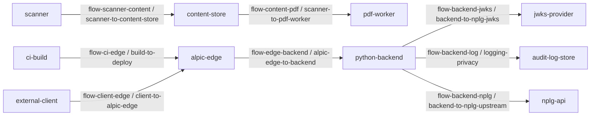

# Phase 0-1 threat model

This document is derived deterministically from `threat-model.json`. It records required controls and unverified assumptions. It does not claim that any ASVS requirement has passed, and the release status is `do_not_release`.

## Provenance and status

- Evidence revision: `da5cc20e4f8bf3e1cacf74c49d5391487cb11cb0`
- Candidate tree SHA-256: `f50987fe97ed12a0da3295929e2ef8dba94693389a0a3bec2b2458a9f87aa32c`
- Release status: `do_not_release`
- Threat verification status: `not_assessed`
- Provider-control status: `assumption-unverified`

## Assets

- `audit-evidence`
- `content-artifacts`
- `credentials-and-signing-material`
- `deployment-artifacts`
- `mcp-protocol-state`
- `public-repository-metadata`

## Data classes

- `access-tokens`
- `audit-events`
- `deployment-provenance`
- `derived-images`
- `mcp-envelopes`
- `public-content`
- `repository-locators`

## Actors

- `deployment-operator`
- `edge-provider`
- `external-client`
- `malicious-client`
- `supply-chain-adversary`
- `untrusted-upstream`

## Nodes and privileges

| Node | Kind | Trust zone | Privileges | Data classes |
| --- | --- | --- | --- | --- |
| alpic-edge | provider | edge-provider-zone | route-mcp-traffic | access-tokens, deployment-provenance, mcp-envelopes |
| audit-log-store | data-store | operations-zone | retain-audit-events | audit-events |
| ci-build | service | build-zone | publish-deployment-artifacts | deployment-provenance |
| content-store | data-store | content-zone | store-public-content | public-content, derived-images |
| external-client | external | untrusted-client-zone | submit-mcp-request | access-tokens, mcp-envelopes |
| jwks-provider | provider | identity-provider-zone | publish-verification-keys | access-tokens |
| nplg-api | provider | nplg-upstream-zone | serve-public-repository-content | public-content, repository-locators |
| pdf-worker | worker | isolated-parser-zone | render-untrusted-pdf | public-content, derived-images |
| python-backend | service | application-zone | authorize-and-dispatch, fetch-public-content | access-tokens, audit-events, mcp-envelopes, public-content, repository-locators |
| scanner | worker | isolated-scanner-zone | classify-untrusted-content | public-content |

## Entry points

| Entry point | Flow | Exposed node | Access control | Profiles | Data classes |
| --- | --- | --- | --- | --- | --- |
| entry-alpic-forward | flow-edge-backend | python-backend | application-enforced | alpic-metadata, private-full, distributed-full | access-tokens, mcp-envelopes |
| entry-audit-log-store | flow-backend-log | audit-log-store | trusted-workload | alpic-metadata, private-full, distributed-full | audit-events |
| entry-content-store | flow-scanner-content | content-store | application-enforced | private-full, distributed-full | public-content |
| entry-deployment-publication | flow-ci-edge | alpic-edge | trusted-workload | alpic-metadata, private-full, distributed-full | deployment-provenance |
| entry-jwks-provider | flow-backend-jwks | jwks-provider | provider-mediated | alpic-metadata, private-full, distributed-full | access-tokens |
| entry-nplg-repository-api | flow-backend-nplg | nplg-api | provider-mediated | alpic-metadata, private-full, distributed-full | public-content, repository-locators |
| entry-pdf-worker | flow-content-pdf | pdf-worker | application-enforced | private-full, distributed-full | public-content, derived-images |
| entry-public-mcp | flow-client-edge | alpic-edge | provider-mediated | alpic-metadata, private-full, distributed-full | access-tokens, mcp-envelopes |

## Data-flow diagram

## Trust boundaries and flows

| Flow | Source | Target | Boundary | Protocol | Data classes |
| --- | --- | --- | --- | --- | --- |
| flow-backend-jwks | python-backend | jwks-provider | backend-to-nplg-jwks | HTTPS JWKS retrieval | access-tokens |
| flow-backend-log | python-backend | audit-log-store | logging-privacy | Structured audit event transport | audit-events |
| flow-backend-nplg | python-backend | nplg-api | backend-to-nplg-upstream | Bounded HTTPS repository request | public-content, repository-locators |
| flow-ci-edge | ci-build | alpic-edge | build-to-deploy | Provider deployment publication | deployment-provenance |
| flow-client-edge | external-client | alpic-edge | client-to-alpic-edge | MCP over HTTPS | access-tokens, mcp-envelopes |
| flow-content-pdf | content-store | pdf-worker | scanner-to-pdf-worker | Descriptor-bound worker input | public-content, derived-images |
| flow-edge-backend | alpic-edge | python-backend | alpic-edge-to-backend | Forwarded MCP request | access-tokens, mcp-envelopes |
| flow-scanner-content | scanner | content-store | scanner-to-content-store | Digest-bound scan verdict | public-content |

## Provider assumptions

| ID | Provider | Unverified control assumption | Owner | Status | Invalidation trigger |
| --- | --- | --- | --- | --- | --- |
| alpic-routing-contract | alpic | Assumption only: the edge preserves the reviewed MCP route and authorization context; no provider evidence currently verifies it. | platform-owner | assumption-unverified | deployment-change |
| audit-log-custody | operations-platform | Assumption only: audit storage enforces access, retention, and integrity policy; no operational evidence currently verifies it. | security-operations-owner | assumption-unverified | storage-change |
| build-runtime-custody | ci-and-alpic | Assumption only: build and deployment identities preserve the reviewed artifact; no external attestation currently verifies it. | release-owner | assumption-unverified | dependency-change |
| jwks-publication-contract | identity-provider | Assumption only: the selected issuer publishes authentic, timely verification keys; no provider has been selected or verified. | identity-owner | assumption-unverified | auth-change |
| nplg-upstream-contract | nplg | Assumption only: the configured NPLG origin serves the intended public repository representation; live provenance is unverified. | repository-owner | assumption-unverified | protocol-change |

## Threat ledger

| ID | STRIDE | Abuse case | Boundaries | Required mitigations | ASVS mappings | Verifier mappings | Provider assumptions | Owner | Status |
| --- | --- | --- | --- | --- | --- | --- | --- | --- | --- |
| threat-auth-token-spoofing | S | An attacker submits a token with an invalid signature, issuer, type, audience, lifetime, or replay context and attempts privileged use. | alpic-edge-to-backend, backend-to-nplg-jwks | Required control: validate signature, issuer, type, audience, and time claims in a trusted backend., Required control: bind session and token context to the selected provider contract; evidence remains Not assessed. | v5.0.0-V10.3.1, v5.0.0-V6.8.2, v5.0.0-V7.2.1, v5.0.0-V9.2.2 | oauth-provider-capability-contract, sdk-authorization-capability-contract | alpic-routing-contract, jwks-publication-contract | identity-owner | not_assessed |
| threat-confused-deputy | T | An attacker manipulates forwarded routing or authorization context so that a more privileged component performs an unauthorized operation. | alpic-edge-to-backend, client-to-alpic-edge | Required control: authorize each tool and object action against explicit caller permissions., Required control: validate edge forwarding and protected-resource contracts; evidence remains Not assessed. | v5.0.0-V8.2.1, v5.0.0-V8.2.2 | alpic-oauth-discovery-contract, mcp-tool-authorization-contract | alpic-routing-contract | application-security-owner | not_assessed |
| threat-log-repudiation | R | An attacker injects misleading log data, causes security events to be omitted, or causes credentials and personal data to enter logs. | logging-privacy | Required control: maintain a field-level logging inventory and encode untrusted values., Required control: exclude or irreversibly mask credentials and tokens; operational evidence remains Not assessed. | v5.0.0-V16.1.1, v5.0.0-V16.2.5, v5.0.0-V16.4.1 | audit-event-schema, credential-canary-log-test | audit-log-custody | security-operations-owner | not_assessed |
| threat-parser-exhaustion | D | A malicious or pathological document consumes excessive bytes, files, pages, CPU, memory, descriptors, or worker lifetime. | scanner-to-content-store, scanner-to-pdf-worker | Required control: enforce pre-dispatch size, count, page, timeout, and quota ceilings., Required control: isolate scanning and rendering and reject unverifiable scan state; evidence remains Not assessed. | v5.0.0-V5.1.1, v5.0.0-V5.2.1, v5.0.0-V5.2.3, v5.0.0-V5.4.3 | pdf-worker-resource-fault-suite, scanner-content-binding-suite | nplg-upstream-contract | content-security-owner | not_assessed |
| threat-ssrf-proxy | I | An attacker supplies or influences a locator that reaches a private, rebinding, redirected, or ambient-proxy destination. | backend-to-nplg-upstream | Required control: allowlist origin, scheme, port, and path and bind every connection to reviewed addresses., Required control: disable ambient proxies and credentials and revalidate redirects; evidence remains Not assessed. | v5.0.0-V1.3.6, v5.0.0-V13.2.4, v5.0.0-V13.2.5 | downloader-rebinding-fault-suite, repository-origin-policy | nplg-upstream-contract | network-security-owner | not_assessed |
| threat-supply-chain | E | A compromised dependency, build runner, artifact mirror, or provider publishes code or configuration outside the reviewed candidate. | build-to-deploy | Required control: verify exact lock identities and an SBOM against resolved components from trusted repositories, including component freshness, with bounded bootstrap verification and atomic publication., Required control: apply documented, risk-ranked remediation timeframes to known-vulnerable and outdated components before release., Required control: bind provider deployment identity to an external attestation; evidence remains Not assessed. | v5.0.0-V15.1.1, v5.0.0-V15.1.2, v5.0.0-V15.2.1 | bootstrap-toolchain-fault-suite, deployment-provenance-attestation | alpic-routing-contract, build-runtime-custody | release-owner | not_assessed |

## Residual risks

| ID | Threats | Description | Owner | Review due | Disposition |
| --- | --- | --- | --- | --- | --- |
| risk-auth-token-spoofing | threat-auth-token-spoofing | Issuer, key-rotation, audience, and replay behavior remain unverified until a provider is selected and externally evidenced. | identity-owner | 2026-12-31 | open-do-not-release |
| risk-confused-deputy | threat-confused-deputy | The exact edge rewrite and authorization propagation contract remains unverified for every deployment profile. | application-security-owner | 2026-12-31 | open-do-not-release |
| risk-log-repudiation | threat-log-repudiation | Operational log custody, retention, access, redaction, and integrity have no approved evidence artifact. | security-operations-owner | 2026-12-31 | open-do-not-release |
| risk-parser-exhaustion | threat-parser-exhaustion | Effective scanner and PDF-worker kernel limits are not yet evidenced against hostile full-profile workloads. | content-security-owner | 2026-12-31 | open-do-not-release |
| risk-ssrf-proxy | threat-ssrf-proxy | Live DNS, peer-address, redirect, TLS, and proxy behavior has not been verified in each target runtime. | network-security-owner | 2026-12-31 | open-do-not-release |
| risk-supply-chain | threat-supply-chain | No approved external release attestation currently binds the reviewed candidate to a provider deployment identity. | release-owner | 2026-12-31 | open-do-not-release |

## Invalidation triggers

- `auth-change`
- `dependency-change`
- `deployment-change`
- `profile-or-boundary-change`
- `protocol-change`
- `runtime-change`
- `storage-change`
